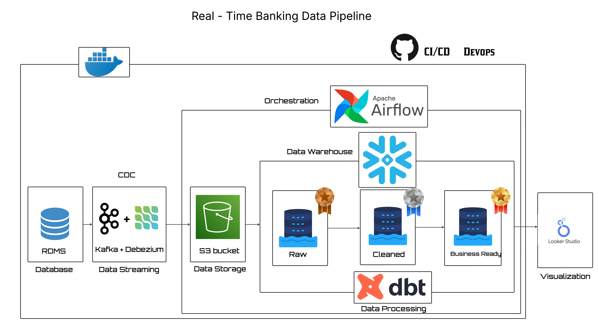

# 🏦 Banking Modern Data Stack

> **An end-to-end production-inspired Modern Data Engineering project for the Banking domain.**

> **Note:** This README was generated as a downloadable file. Expand it further with screenshots and setup commands specific to your environment if needed.

## Overview

This project demonstrates how a modern banking analytics platform can be built using industry-standard data engineering tools. Synthetic banking data is generated, captured through Change Data Capture (CDC), streamed through Kafka, stored in object storage, orchestrated by Airflow, transformed with dbt inside Snowflake, and finally visualized using Looker Studio.

## Architecture



### Pipeline Flow

1. PostgreSQL (OLTP)
2. Debezium CDC
3. Apache Kafka
4. MinIO
5. Apache Airflow
6. Snowflake (Bronze → Silver → Gold)
7. dbt
8. Looker Studio

## Technology Stack

| Layer | Technology |
|------|------------|
| Source | PostgreSQL |
| CDC | Debezium |
| Streaming | Apache Kafka |
| Storage | MinIO |
| Orchestration | Apache Airflow |
| Warehouse | Snowflake |
| Transformation | dbt |
| BI | Looker Studio |
| Programming | Python |
| Infrastructure | Docker |
| CI/CD | GitHub Actions |

## Key Features

- End-to-end modern data pipeline
- Change Data Capture (CDC)
- Medallion Architecture
- Incremental ELT
- dbt snapshots (SCD Type-2)
- Automated orchestration with Airflow
- Interactive BI dashboard
- Dockerized infrastructure
- CI/CD pipeline

## Repository Structure

```text
banking-modern-datastack/
├── banking_dbt/
├── consumer/
├── data-generator/
├── docker/
├── kafka-debezium/
├── postgres/
├── Looker Dashboard/
│   ├── Customer_Transactions_&_Account_Analytics_Dashboard.pdf
│   ├── image_cf593b.png
│   └── README.md
├── docker-compose.yml
├── pipeline_png.png
├── requirements.txt
└── README.md

```

## Implementation

### Step 1 — Data Generation

Python Faker generates realistic banking data including customers, accounts and transactions.

### Step 2 — CDC

Debezium monitors PostgreSQL WAL and publishes change events into Kafka.

### Step 3 — Object Storage

Kafka consumer writes events into MinIO.

### Step 4 — Airflow

Airflow orchestrates ingestion, snapshots and transformations.

### Step 5 — Snowflake

Data is organized using Bronze, Silver and Gold layers.

### Step 6 — dbt

dbt performs:

* Testing
* Incremental models
* Snapshots
* Star schema modeling

### Step 7 — Analytics

Looker Studio consumes Gold models to build dashboards.

## Dashboard & Analytics

The reporting layer consists of a Looker Studio dashboard that maps analytical layers directly into business views. For extensive data blending architectures, see the sub-folder [Looker Dashboard Readme](https://www.google.com/search?q=./Looker%2520Dashboard/README.md).

🔗 **Live Dashboard Link:** **[Customer Transactions & Account Analytics Dashboard](https://datastudio.google.com/u/0/reporting/73aefbee-18e4-45a7-9f40-908c2d859adb/page/RHd3F)**

### 📊 Dashboard Preview
<p align="center">
  
</p>

## Learning Outcomes

This project demonstrates practical experience with:

* Data Warehousing
* CDC
* Kafka
* Snowflake
* Airflow
* dbt
* ELT
* Data Modeling
* Docker
* Python
* SQL
* GitHub Actions

---
 
 
GitHub: [https://github.com/HarshKumarGuptagit](https://github.com/HarshKumarGuptagit)

If you found this project useful, consider giving it a ⭐.

---
